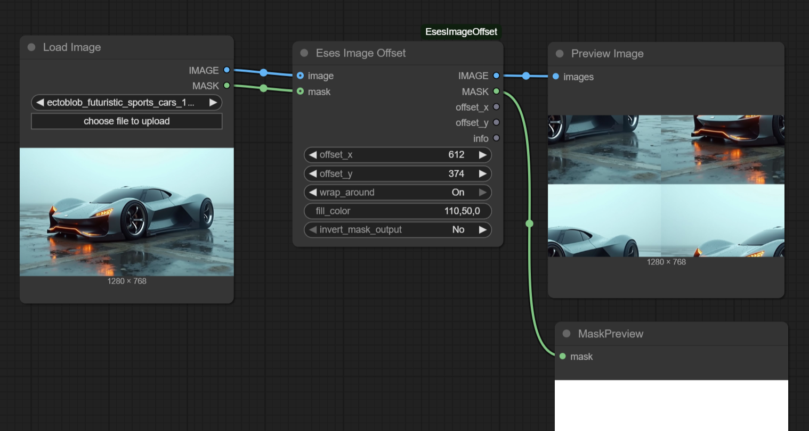

# Eses Image Offset




> [!CAUTION]
> Before dowloading and using the contents of this repository, please read the LICENSE.txt and the disclaimer - Thank you!


## Description

The 'Eses Image Offset' node offers basic image offsetting capabilities within ComfyUI. It allows shifting image and mask content horizontally and/or vertically, with an option to wrap content around the canvas edges for a tiling effect. 

💡This node offsets both the image and an optional mask as input.

💡Node also outputs applied X and Y offsets, and a descriptive information string.

## Features

* **Image and Mask Offsetting**: Shift both image and an optional mask horizontally and/or vertically.
* **Wrap Around Option**: Choose to wrap content around the canvas edges for a tiling effect, or fill newly exposed areas with a specified color.
* **Fill Color Control**: Define the fill color for areas exposed by offsetting when the "wrap around" option is off.
* **Mask Inversion**: Option to invert the output mask.
* **Informative Output**: Provides the applied offsets and an information string detailing the transformation.


## Requirements

* PyTorch – (you should have this if you have ComfyUI installed).
* PIL (Pillow) – (usually included with ComfUI).
* Numpy – (usually included with ComfUI).


## Installation

1.  **Navigate to your ComfyUI custom nodes directory:**
    ```
    ComfyUI/custom_nodes/
    ```

2.  **Clone this repository:**
    ```
    git clone https://github.com/quasiblob/EsesImageOffset.git
    ```

3.  **Restart ComfyUI:**
    * After restarting, the "Eses Image Offset" node will be available in the "Eses Nodes/Image" category.


## Folder Structure

```
ComfyUI-EsesImageOffset/
├── init.py                     # Main module defining the custom node.
├── image_offset.py             # The Python file containing the node logic.
└── README.md                   # This file.
└── docs/
```


## Usage

* Connect an image and/or a mask to the node.
* Adjust the `offset_x` and `offset_y` parameters to shift the content.
* Toggle `wrap_around` to enable or disable tiling.
* Set `fill_color` if `wrap_around` is "Off".
* Choose `invert_mask_output` to invert the resulting mask.


## Inputs

* **offset\_x** (`INT`, *required*): Horizontal offset value. Default is 0, range from -4096 to 4096.
* **offset\_y** (`INT`, *required*): Vertical offset value. Default is 0, range from -4096 to 4096.
* **wrap\_around** (`["Off", "On"]`, *required*): Determines if the image content wraps around the edges.
* **fill\_color** (`STRING`, *required*): RGB or RGBA color string (e.g., "0,0,0" for black, "255,255,255,128" for semi-transparent white).
* **invert\_mask\_output** (`["No", "Yes"]`, *required*): If "Yes", the output mask will be inverted.
* **image** (`IMAGE`, *optional*): The input image to be offset.
* **mask** (`MASK`, *optional*): An optional mask to be offset alongside the image.


## Outputs

* **IMAGE** (`IMAGE`): The processed image after applying the offset and fill.
* **MASK** (`MASK`): The processed mask after applying the offset and inversion.
* **offset\_x** (`INT`): The X offset that was applied.
* **offset\_y** (`INT`): The Y offset that was applied.
* **info** (`STRING`): A descriptive string detailing the applied transformations.


## Category

Eses Nodes/Image

## Contributing

* Feel free to report bugs and improvement ideas in issues, but I may not have time to do anything.

## License

* See LICENSE.txt

## About

-

## Update History

* 2025.6.26 Version 1.0.0 released


## ⚠️Disclaimer⚠️

This custom node for ComfyUI is provided "as is," without warranty of any kind, express or implied. By using this node, you agree that you are solely responsible for any outcomes or issues that may arise. Use at your own risk.


## Acknowledgements

Thanks to the ComfyUI team and community for their ongoing work!